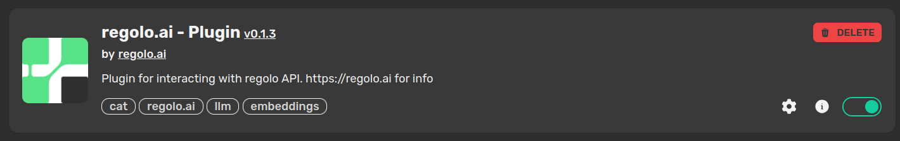

# 🐱 Cheshire Cat Plugin for Regolo.ai

**Bring the magic of [Cheshire Cat](https://cheshirecat.ai/) to your Regolo-powered AI workflows.**
This plugin seamlessly connects your **Cheshire Cat** environment with **Regolo.ai**, allowing you to choose and use advanced LLMs and embedders effortlessly.

---

## 🚀 Overview

The **Cheshire Cat Plugin for Regolo.ai** enables smooth integration between [Cheshire Cat](https://cheshirecat.ai/) and **Regolo.ai**.
With this plugin, you can:

* 🔄 Select and switch between Regolo LLMs directly inside Cheshire Cat.
* 🧠 Use Regolo’s powerful embedding models for enhanced context and retrieval.
* ⚙️ Manage everything from Cheshire Cat’s intuitive interface.

---

## 🧩 Installation

1. Make sure [Cheshire Cat](https://cheshire-cat-ai.github.io/docs/quickstart/installation-configuration/) is properly installed and configured.
2. In Cheshire Cat’s **Plugins** section, search for **"Regolo"**.
3. Click **Install** — and you’re ready to go!

---

## ⚙️ Configuration

### 1. Authenticate with Your API Key

1. Go to the **Plugins** section in Cheshire Cat.
2. Scroll down until you find the **Regolo plugin**.
   
3. Click the **Options ⚙️** icon.
4. Paste your **Regolo API key** into the input field.
5. Click **Save** — don’t forget this step!

---

### 2. Configure a Language Model (LLM)

1. Navigate to **Settings → Large Language Model**.
2. Select **Regolo LLM** from the dropdown menu.
3. Choose your preferred model from the available list.

---

### 3. Configure an Embedder

1. Navigate to **Settings → Embedder**.
2. Select **Regolo embedder models**.
3. Pick the embedder model that best suits your task.

> [!TIP]
> If some models don’t appear in your list, verify that your API key includes access to those models.
> You can generate a new key anytime from your [Regolo.ai dashboard](https://regolo.ai).

---

## 💡 Usage

Once configured, the plugin is ready to use!
You can now leverage Regolo’s models and embeddings directly from [Cheshire Cat](https://cheshirecat.ai/) to power your conversations, automations, and AI projects.

---

## 🧰 Troubleshooting

* **Invalid API Key:** Double-check and re-enter your key in the plugin options.
* **Post-Update Errors:** Try reinstalling the plugin. If issues persist, restart your Docker container (be sure to back up your data first).

---

✨ **Unleash the full potential of your AI — let your Cheshire Cat grin with Regolo!**
